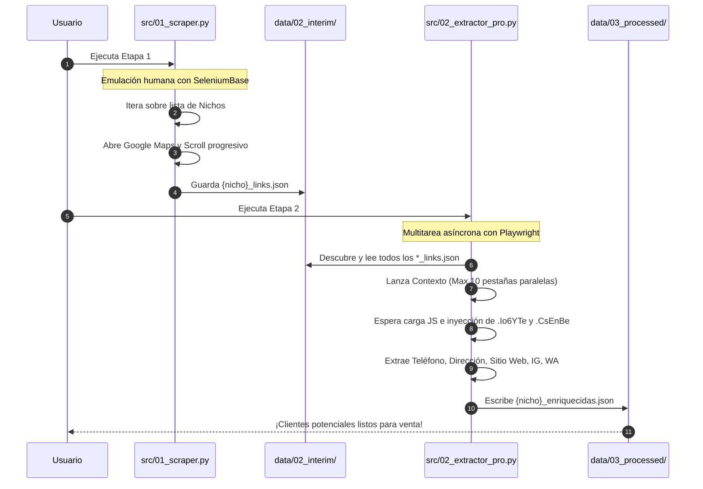
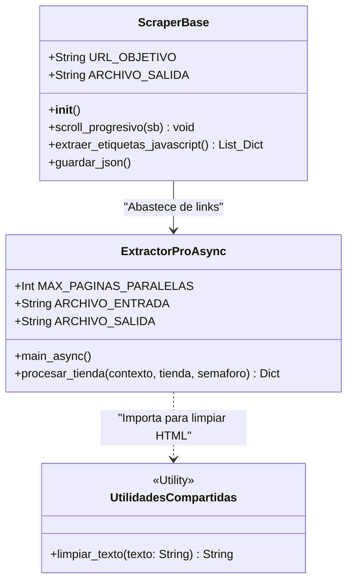

# 🚀 Clientes Automáticos Maps - Worship

## 📖 Descripción del Proyecto
Este ecosistema automatizado de extracción avanzada (Web Scraping) está diseñado para recolectar clientes potenciales de Google Maps. 

El flujo está estructurado en un **Pipeline de tres etapas (Fase 3 de Arquitectura)** que combina técnicas robustas de raspado multinicho en todo el Valle del Cauca (42 Municipios), usando *SeleniumBase* en su primera mitad, extracción asíncrona con *Playwright* en su segunda mitad y una arquitectura orientada a objetos (POO) para la consolidación en *Excel* hoja por hoja en su etapa final.

---

## 🏗️ Arquitectura del Proyecto (Fase 2)

El directorio de este proyecto obedece a buenas prácticas de ingeniería de software, enfocándose en la modularidad y separación de componentes.

```mermaid
graph TD
    A[clientes-potenciales/] --> B(data/)
    A --> C(src/)
    A --> D(utils/)
    
    B --> B1(01_raw/)
    subgraph Almacenamiento Estructurado
    B2(02_interim/)
    B3(03_processed/)
    B4(04_exports/)
    end
    B --> B2
    B --> B3
    B --> B4
    
    subgraph Scripts Fuente (Etapas 1 a 3)
    C1(01_scraper.py)
    C2(02_extractor_pro.py)
    C3(03_excel_exporter.py)
    end
    C --> C1
    C --> C2
    C --> C3
    
    subgraph Clases y Utils
    D1(helpers.py)
    D2(data_manager.py)
    D3(municipios.py)
    end
    D --> D1
    D --> D2
    D --> D3
    
    D2 -.->|Organiza I/O| C1
    D2 -.->|Organiza I/O| C2
    D2 -.->|Construye XLSX| C3
    
    C1 -->|Crea JSON de links Múltiples| B2
    C2 -->|Crea JSON final de contactos| B3
    C3 -->|Pestañas separadas por Municipio| B4
```

---

## 🔄 Diagrama de Flujo (Pipeline Paso a Paso)

El siguiente modelo de secuencia demuestra cómo interactúa cada componente con su base de datos designada dentro del nuevo esquema de la Fase 2.



---

## 🧠 Diagrama de Clases y Funciones Conceptuales

El diseño base que representa la orientación del código detrás de cada script que compone este ecosistema.



---

## ⚙️ Instalación y Requisitos

Si estás clonando el proyecto en un nuevo entorno, asegúrate de tener todo lo necesario.

### 1. Prerrequisitos
- Python 3.9 o superior

### 2. Archivo de Dependencias
Abre tu terminal y ejecuta:
```bash
pip install seleniumbase playwright
playwright install chromium
```

---

## 🚀 Guía de Uso Rápido

### Etapa 1 (Minería de Enlaces Regional)
Se encarga de engañar a Google iterando automáticamente de forma anidada sobre una lista de nichos en los **42 Municipios del Valle del Cauca**. **Implementa Checkpointing (Reanudación automática)** gracias a la clase OOP `DataManager`. Los resultados se estructuran dinámicamente en la carpeta `02_interim`.
```bash
python src/01_scraper.py
```

### Etapa 2 (Enriquecimiento Simultáneo)
Procesa automáticamente todos los JSON intermedios (`{nicho}_{municipio}_links.json`). Toma en paralelo 10 URLs usando contextos ligeros para extraer contactos ocultos por JavaScript. **Integra Lógica de Reintentos (Retry Automático)** hasta 3 veces ante fallos, estructurando todo en `03_processed`.
```bash
python src/02_extractor_pro.py
```

### Etapa 3 (Exportación Comercial Excel)
La joya de la corona del ecosistema orientado a objetos. Toma todos los JSON enriquecidos y, a través de `DataManager`, los consolida produciendo un (1) archivo central de Excel por nicho (Ej: `restaurantes_directorio.xlsx`), donde cada pestaña (hoja) representa de manera independiente a un municipio particular.
```bash
python src/03_excel_exporter.py
```
