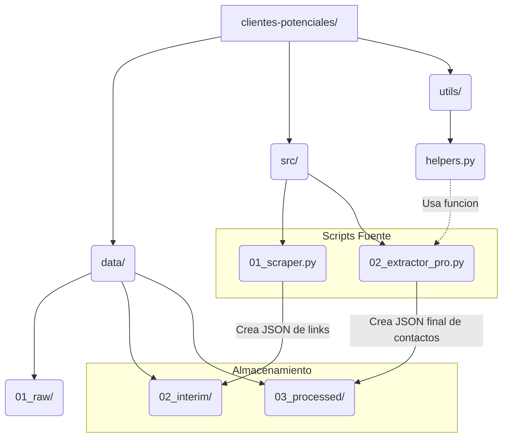
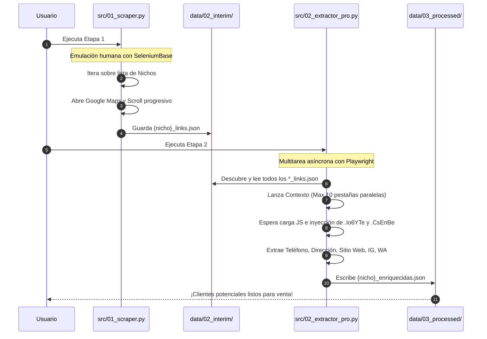
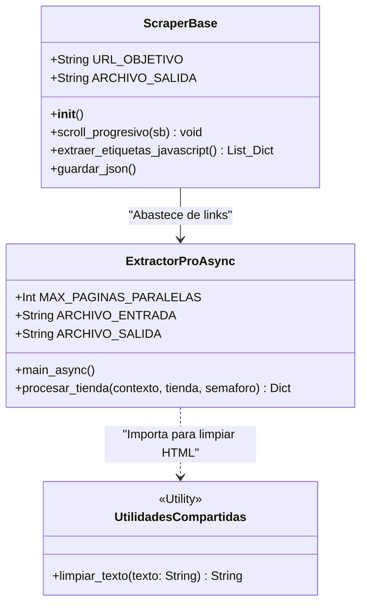

# 🚀 Clientes Automáticos Maps - Worship

## 📖 Descripción del Proyecto
Este ecosistema automatizado de extracción avanzada (Web Scraping) está diseñado para recolectar clientes potenciales de Google Maps. 

El flujo está estructurado en un **Pipeline de dos etapas (Fase 2 de Arquitectura)** que combina técnicas de evasión de bloqueos con *SeleniumBase* en su primera mitad, y extracción ultrarrápida multihilo asíncrona con *Playwright* en su segunda mitad. Todo rediseñado bajo estándares profesionales separando lógica fuente (`src`), utilidades (`utils`), y almacenamiento progresivo de datos (`data`).

---

## 🏗️ Arquitectura del Proyecto (Fase 2)

El directorio de este proyecto obedece a buenas prácticas de ingeniería de software, enfocándose en la modularidad y separación de componentes.



---

## 🔄 Diagrama de Flujo (Pipeline Paso a Paso)

El siguiente modelo de secuencia demuestra cómo interactúa cada componente con su base de datos designada dentro del nuevo esquema de la Fase 2.



---

## 🧠 Diagrama de Clases y Funciones Conceptuales

El diseño base que representa la orientación del código detrás de cada script que compone este ecosistema.



---

## ⚙️ Instalación y Requisitos

Si estás clonando el proyecto en un nuevo entorno, asegúrate de tener todo lo necesario.

### 1. Prerrequisitos
- Python 3.9 o superior

### 2. Archivo de Dependencias
Abre tu terminal y ejecuta:
```bash
pip install seleniumbase playwright
playwright install chromium
```

---

## 🚀 Guía de Uso Rápido

### Etapa 1 (Minería de Enlaces)
Se encarga de engañar a Google para descubrir de forma rápida y legal todos los locales que aparezcan en un área seleccionada, iterando automáticamente sobre una lista de nichos (tiendas, restaurantes, farmacias, etc.). **Implementa Checkpointing (Reanudación automática)**, por lo que si el código se interrumpe, retomará inteligentemente desde el progreso actual saltándose archivos existentes. Los resultados se guardan en la carpeta temporal de datos intermedios como archivos separados por nicho.
```bash
python src/01_scraper.py
```

### Etapa 2 (Enriquecimiento Simultáneo)
Procesa automáticamente todos los archivos JSON de nichos generados en la etapa anterior. Toma en paralelo 10 URLs por lote desde los datos intermedios y usa contextos fantasma súper-rápidos que permiten extraer contactos ocultos por JavaScript. **Integra Lógica de Reintentos (Retry Automático)** que intenta abrir el local hasta 3 veces si detecta bloqueos de red, generando registros de depuración precisos (`alertas_fallos.json`) con las tiendas imposibles de acceder. Los contactos exitosos se consolidan en archivos JSON separados por nicho listos para su uso.
```bash
python src/02_extractor_pro.py
```
